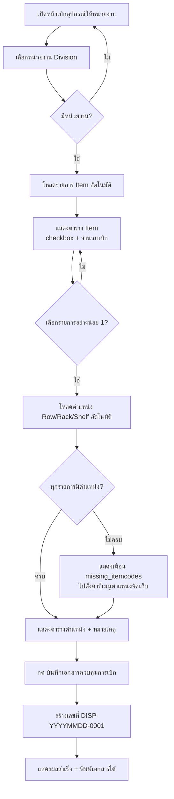
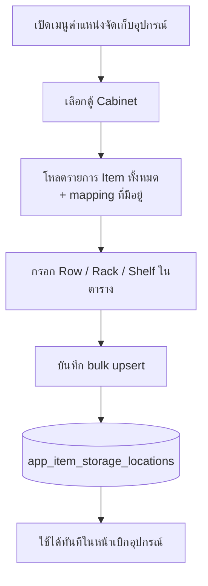

# เบิกอุปกรณ์ให้หน่วยงาน (Department Dispense)

เอกสารสรุปการทำงานของฟีเจอร์ **เอกสารควบคุมการเบิกอุปกรณ์ให้หน่วยงาน** และเมนูที่เกี่ยวข้อง **ตำแหน่งจัดเก็บอุปกรณ์**

---

## ภาพรวม

ระบบนี้ใช้สำหรับ **เบิกอุปกรณ์ให้หน่วยงาน (Division)** โดยบันทึกเป็น **เอกสารควบคุมการเบิก** พร้อม snapshot ตำแหน่งจัดเก็บ **Row / Rack / Shelf** ณ วันที่บันทึก

| ส่วน | หน้าที่ |
|------|---------|
| **เบิกอุปกรณ์ให้หน่วยงาน** | เลือกหน่วยงาน → เลือกรายการเบิก → ดูตำแหน่ง → บันทึกเอกสาร |
| **ตำแหน่งจัดเก็บอุปกรณ์** | ตั้งค่า Row/Rack/Shelf ต่อตู้ (stock_id + itemcode) ล่วงหน้า |

> ทั้งสองเมนูใช้ตารางเดียวกัน: `app_item_storage_locations`

---

## เมนูในระบบ (Admin)

| เมนู | Path |
|------|------|
| อุปกรณ์ → **เบิกอุปกรณ์ให้หน่วยงาน** | `/admin/department-dispense` |
| ตั้งค่า → **ตำแหน่งจัดเก็บอุปกรณ์** | `/admin/management/storage-locations` |

---

## Flow การใช้งาน (หน้าเบิกอุปกรณ์)

หน้าเบิกเป็น **หน้าเดียว** ไม่มีปุ่ม "ถัดไป" — แต่ละส่วนแสดงอัตโนมัติตามการเลือกของผู้ใช้



### ขั้นตอนที่ผู้ใช้เห็น

1. **เลือกหน่วยงาน** — จากตาราง `department` (Division) ที่ผูกตู้แล้ว
2. **เลือกรายการเบิก** — รายการจาก `itemdepartment` (Item ที่ผูกกับหน่วยงานนั้น)
3. **ตำแหน่ง + บันทึก** — แสดง Row/Rack/Shelf จาก `app_item_storage_locations` แล้วบันทึกเอกสาร

---

## Flow ข้อมูล (Data Flow)

```mermaid
flowchart LR
    subgraph เบิกอุปกรณ์
        DEPT[department<br/>Division]
        ID[itemdepartment<br/>รายการที่เบิกได้]
        ITEM[item<br/>ชื่อ/รหัส]
        DOC[app_department_dispense_documents]
        LINE[app_department_dispense_document_lines]
    end

    subgraph ตำแหน่งจัดเก็บ
        CD[app_cabinet_departments<br/>ACTIVE]
        CAB[app_cabinets<br/>stock_id]
        LOC[app_item_storage_locations<br/>Row/Rack/Shelf]
    end

    DEPT --> ID
    ID --> ITEM
    DEPT --> CD
    CD --> CAB
    CAB --> LOC
    LOC --> LINE
    DOC --> LINE
```

### รายการเบิกมาจากไหน?

```
department (Division)
  └── itemdepartment (DeptID = department.ID)
        └── item (itemcode, itemname)
```

- แสดงเฉพาะ Item ที่ **ยังไม่ถูกยกเลิก** (`IsCancel`, `item_status`)
- ค้นหาได้ด้วยรหัสหรือชื่อ Item

### ตำแหน่งมาจากไหน?

```
department (Division)
  └── app_cabinet_departments (status = ACTIVE)
        └── app_cabinets (stock_id)
              └── app_item_storage_locations (stock_id + itemcode)
                    → location_row, location_rack, location_shelf
```

- ต้องมี **ตู้ผูกหน่วยงาน** และตู้มี `stock_id`
- ต้องมี **แถวตำแหน่ง** ใน `app_item_storage_locations` สำหรับ `(stock_id, itemcode)` นั้น
- ถ้าไม่พบ → รายการจะอยู่ใน `missing_itemcodes` และ **บันทึกเอกสารไม่ได้**

---

## Flow ตั้งค่าตำแหน่ง (เมนูตำแหน่งจัดเก็บ)



- Key ของตำแหน่ง: **`stock_id` + `itemcode`** (unique)
- ไม่ผูกกับ slot/sensor ของตู้ — เป็นข้อมูลตำแหน่งจัดเก็บแยกต่างหาก

---

## ตารางฐานข้อมูลหลัก

| ตาราง | ใช้ทำอะไร |
|-------|-----------|
| `department` | หน่วยงาน (Division) |
| `itemdepartment` | ผูก Item กับหน่วยงาน — ใช้เป็นรายการเบิก |
| `app_cabinet_departments` | ผูกตู้กับหน่วยงาน |
| `app_cabinets` | ตู้ Smart Cabinet (`stock_id`) |
| `app_item_storage_locations` | ตำแหน่ง Row/Rack/Shelf ต่อ stock_id + itemcode |
| `app_department_dispense_documents` | หัวเอกสารควบคุมการเบิก |
| `app_department_dispense_document_lines` | รายการในเอกสาร + snapshot ตำแหน่ง |

### เลขที่เอกสาร

รูปแบบ: **`DISP-YYYYMMDD-0001`**

- รันต่อวัน (sequence เริ่มใหม่ทุกวัน)
- ตัวอย่าง: `DISP-20260713-0001`, `DISP-20260713-0002`

---

## API (Backend)

Base path: `/department-dispense` (ต้อง login ผ่าน `AuthGuard`)

| Method | Endpoint | คำอธิบาย |
|--------|----------|----------|
| `GET` | `/department-dispense/department-items?department_id=&keyword=` | รายการ Item ของหน่วยงาน |
| `POST` | `/department-dispense/item-locations` | หาตำแหน่ง Row/Rack/Shelf |
| `POST` | `/department-dispense/documents` | บันทึกเอกสารควบคุมการเบิก |
| `GET` | `/department-dispense/documents` | รายการเอกสาร (ประวัติ) |
| `GET` | `/department-dispense/documents/:id` | รายละเอียดเอกสาร |

### ตั้งค่าตำแหน่ง (เมนูแยก)

Base path: `/cabinet-slot-locations`

| Method | Endpoint | คำอธิบาย |
|--------|----------|----------|
| `GET` | `/cabinet-slot-locations/cabinet-items?cabinet_id=` | รายการ Item + mapping |
| `POST` | `/cabinet-slot-locations/bulk` | บันทึก Row/Rack/Shelf หลายรายการ |

---

## โครงสร้างไฟล์ในโปรเจกต์

```
backend/
  src/department-dispense/
    department-dispense.controller.ts
    department-dispense.service.ts
    utils/resolve-item-location.ts
  src/cabinet-slot-location/
    cabinet-slot-location.controller.ts
    cabinet-slot-location.service.ts
  prisma/migrations/
    20260713120000_add_department_dispense_documents/
    20260713160000_add_item_storage_locations/

frontend/
  src/app/admin/department-dispense/
    page.tsx
    components/DepartmentDispenseWizard.tsx
  src/app/admin/management/storage-locations/
    page.tsx
    components/StorageLocationWizard.tsx
  src/lib/departmentDispenseApi.ts
  src/lib/cabinetSlotLocationApi.ts
```

---

## เงื่อนไขสำคัญ / Troubleshooting

| อาการ | สาเหตุที่พบบ่อย | แก้ไข |
|-------|-----------------|-------|
| ไม่มีรายการ Item | Item ยังไม่ผูกใน `itemdepartment` | ผูก Item กับ Division ในระบบหลัก |
| ไม่พบตำแหน่ง | ยังไม่ตั้งค่าใน `app_item_storage_locations` | ไปเมนู **ตำแหน่งจัดเก็บอุปกรณ์** |
| ไม่พบตำแหน่ง (ทั้งที่ตั้งแล้ว) | หน่วยงานไม่ได้ผูกตู้ หรือ `stock_id` ไม่ตรง | ตรวจ `app_cabinet_departments` + `app_cabinets` |
| บันทึกไม่ได้ | มีรายการใน `missing_itemcodes` | ตั้งตำแหน่งให้ครบทุก itemcode ที่เลือก |

---

## สรุปสั้น ๆ

1. **ตั้งตำแหน่งก่อน** ที่เมนูตำแหน่งจัดเก็บอุปกรณ์ (เลือกตู้ → กรอก Row/Rack/Shelf)
2. **เบิกอุปกรณ์** ที่เมนูเบิกอุปกรณ์ให้หน่วยงาน (เลือกหน่วยงาน → เลือก Item → บันทึกเอกสาร)
3. รายการเบิก = **`itemdepartment`** | ตำแหน่ง = **`app_item_storage_locations`** | ผลลัพธ์ = **เอกสารควบคุมการเบิก** พร้อมพิมพ์ได้
